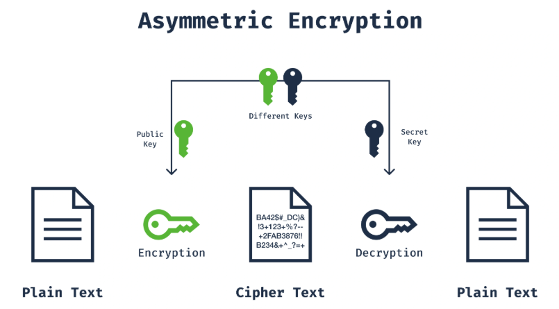

# Table of Contents

1.  [algorithms](#orgbe12123)
2.  [public key infrastructure (PKI)](#org3a849f5)
3.  [digital signatures](#org941f298)
4.  [applications of Asymmetric encryption](#org01489de)

Asymmetric encryption is a method of encryption where two different keys are used for encryption and decryption processes. These keys are known as the public key and the private key

The public key is acessible to everyone, while the private key is known and protected only by its owner. Asymmetric encryption is more secure compared to symmetric encryption but is slower

**Advantages** ->

-   Key Distribution: The key distribution issues of symmetric encryption are resolved with asymmetric encryption.
-   Security: The use of two keys enhances the system&rsquo;s security.
-   Authentication: Provides authentication through digital signatures and certificates.

**Disadvantages** ->

-   Performance: Asymmetric encryption algorithms are slower compared to symmetric encryption algorithms.
-   Computational Power: Requires more computational resources.

# algorithms

**RSA** -> (Rivest-Shamir-Adleman)

-   Offers key lengths of 1024, 2048 and 4096 bits

**ECC** -> (Elloptic Curve Cryptography)

-   Provides similar security to RSA, but shorter key lengths
-   Require less computational power

**ElGamal** ->

-   Can be used for encryption and digital signatures
-   Its security is based on the difficulty of solving

**DSA** -> (Digital Signature Algorithm)

-   Standardized by NIST
-   Only used for crating and verifying digital signatures

# public key infrastructure (PKI)

Public key infrastructure (PKI) uses digital certificates and certificate authorities (CAs) to securely distribute and manage public keys. The main components ->

**CA** -> Certificate Authorities
Organizations that validate and secure public keys with digital certificates. Perform certificate signing and revocation to ensure validity.

**RA** -> Registration Authorities
Organizations that handle authentication and registration processes on behalf of certificate authorities.

**Digital Certificates** ->
Digital documents containing a user&rsquo;s or device&rsquo;s public key and identity information. Signed and validated by a certificate authority.

**Certificate Repositories** ->
Databases where digital certificates are stored and managed.

# digital signatures

Digital signatures are used to verify the identity of the sender and ensure the integrity of a document or message. Digital signatures are typically created using asymmetric encryption algorithms.

**Creating a Digital Signature**

-   The document&rsquo;s hash value is computed.
-   The hash value is encrypted with the sender&rsquo;s private key, creating the digital signature.

**Verifying a Digital Signature**

-   The recipient recomputes the document&rsquo;s hash value.
-   The recipient decrypts the digital signature using the sender&rsquo;s public key and compares the obtained hash value.
-   If the two hash values match, the document&rsquo;s integrity and identity are verified.

# applications of Asymmetric encryption

**SSL/TLS**

-   Used to secure communication between web browsers and servers.
-   Provides website authentication and data integrity.

**Email Security**

-   Encryption and digital signing of emails using protocols such as PGP (Pretty Good Privacy) and S/MIME (Secure/Multipurpose Internet Mail Extensions).

**VPN**

-   Provides secure communication between remote networks.

**Digital Certificates and Authentication**

-   Used for user authentication in e-commerce, banking, and other digital services.

**File and data encryption**

-   Ensures the secure storage and transmission of sensitive data.

