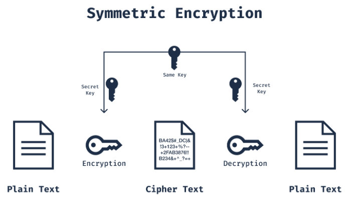

# Table of Contents

1.  [intro](#org4a195c3)
2.  [block ciphers](#orgebace95)
3.  [stream ciphres](#org529893b)

# intro

Symmetric encryption is a method of encryption where the same key is used for both encryption and decryption.

In this method, both the sender and the receiver share a secret key, which is used to encrypt and decrypt data.

Symmetric encryption is fast and efficient but can face challenges in key distribution and management

**Advantages** ->

-   Speed: Symmetric encryption algorithms are much faster than asymmetric encryption algorithms.
-   Efficiency: Requires fewer computational resources.
-   Simplicity: Algorithms and implementations are generally simpler.

**Disadvantages** ->

-   Key Distribution: Securely sharing and distributing the key can be challenging.
-   Key Management: Managing a large number of keys can be complex, especially in large networks.
-   Security: If the key is compromised, all encrypted data is at

Symmetric encryption algorithms can be categorized into two main types:
**block ciphers** and **stream ciphers**

# block ciphers

Process data in fixed-size blocks, performing encryption and decryption operations on each block using a specific algorithm and key

**DES** -> (Data Encryption Standard)

-   uses 56-bit key lenght
-   insecure

**3DES** -> (Triple DES)

-   uses 168-bit key length
-   encryption using DES three times

**AES** -> (Advanced Encryption Standard)

-   Standard by NIST
-   supports key lengths of 128, 192 and 256 bits

# stream ciphres

Stream ciphers process data as stream of bits or bytes, performing encryption and decryption operations on the data stream.

This method is especially suitable for encrypting data streams.

**RC4** -> (Rivest Cipher 4)

-   has a variable key length
-   fast and simple, has some security weakness

**Salsa20 and ChaCha20**

-   secure and fast stream ciphers
-   environments which require low power consumption, like IoT devices

